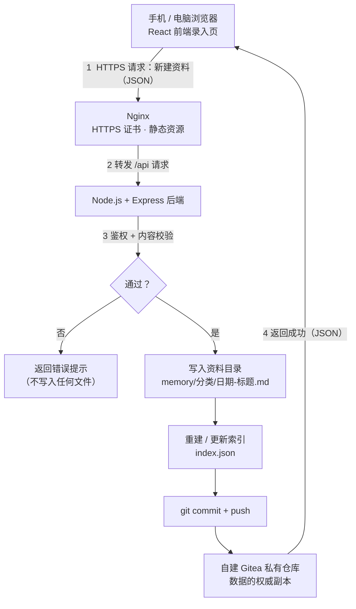
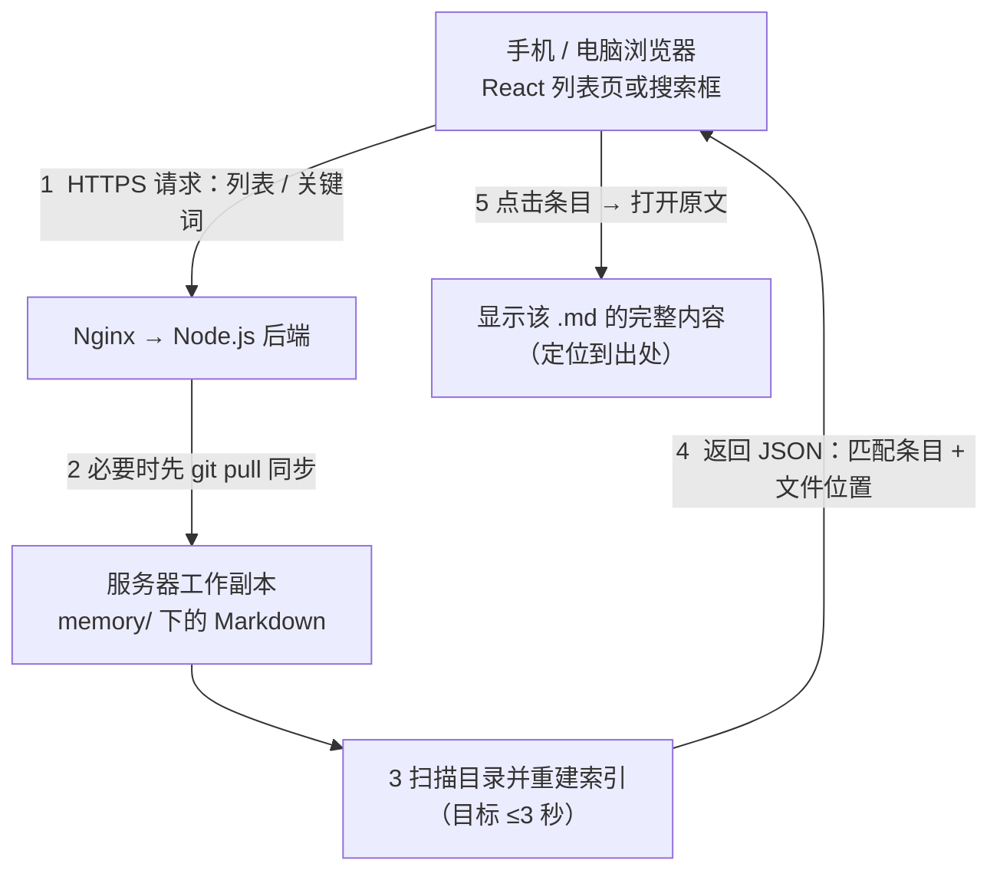
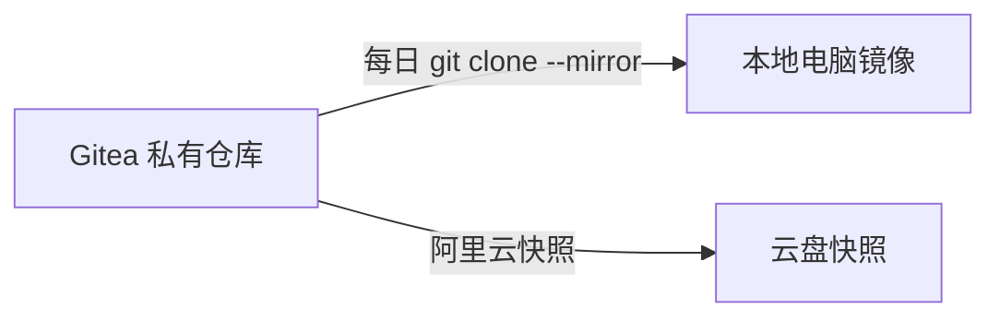
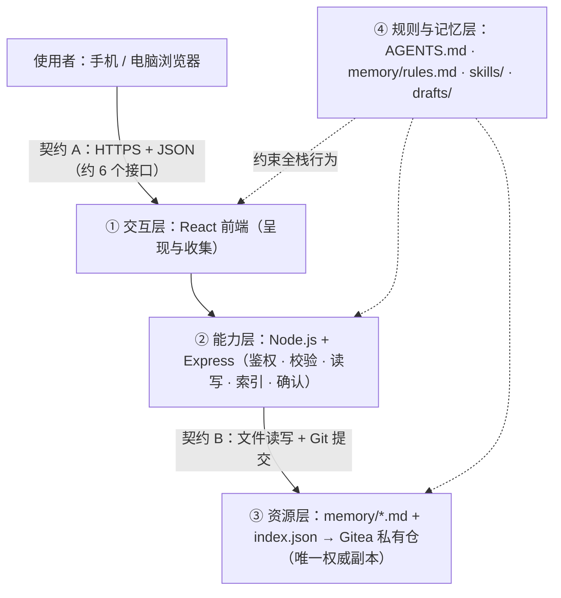

# TECH_DESIGN.md — buddy 技术设计（MVP · 第 1 期）

> 上游依据：`PRD.md` v1.1（F1–F7 与 25 条验收标准）｜ 日期：2026-09-19
> 本次范围：**只做技术设计，不写代码**；数据流图见第 4 章
> 原则：能跑通 > 花哨；数据自有 > 平台便利；每层可替换 > 一次到位

## 1. 设计目标与约束

**要支撑的功能**：F1 资料录入 / F2 列表与检索 / F3 索引自动更新 / F4 手机端发起任务 / F5 查看进度 / F6 确认操作 / F7 数据自托管与可迁移。

**硬约束（来自 PRD 与现有条件）**：

| 约束 | 来源 |
|---|---|
| 单人使用，不做多用户与协作 | PRD 第 2 章 |
| 手机浏览器直接访问，**不装客户端**；公网 HTTPS + 登录 | PRD F4、第 5 章 |
| 个人资料存自建私有仓库，公开仓库里看不到 | PRD F1、F7、第 5 章 |
| 部署在已有阿里云 ECS（2 vCPU / 4GB） | 使用者现有资源 |
| 第 1 期不引入数据库；索引可再生即可 | PRD 第 8 章风险 4 |
| 开发环境：Windows 11 + Node 22 / Python 3.13 | 本机实测 |

## 2. 三层分工（各层只干自己的事）

| 层 | 职责（一句话） | 对应功能 |
|---|---|---|
| **前端** | 把界面做好、把用户输入打包成请求、把结果显示出来 | F1 录入页、F2 列表与搜索页、F5 状态页、F6 确认页 |
| **后端** | 鉴权、校验、读写资料文件、重建索引（唯一的守门人） | F1（写文件）、F2（读+检索）、F3（重建索引）、F4/F5/F6（任务与确认） |
| **存储** | 只管存放：资料目录（Markdown）+ 索引文件 + Git 私有仓库 | F7（自有、可迁移） |

**层间契约**：前端与后端之间只通过 **HTTPS 上的 JSON 请求/响应**通信；后端与存储之间只通过**文件读写与 Git 提交**。任何一层换实现，其他层不需要改。

## 3. 技术路线（选型 / 理由 / 备选与暂时不选的原因）

| # | 层面 | 选型 | 为什么选它 | 备选方案 | 为什么暂时不选 |
|---|---|---|---|---|---|
| 1 | 前端 | **React + Vite 构建**（响应式，同一套页面适配手机与电脑） | 组件化开发，第 2 周要做前端主视图、统一风格、多级页面与四种状态，用框架能省下大量重复代码；生态成熟、AI 生成质量高；Vite 提供开发热更新与生产构建 | 原生 HTML + CSS + JS | 无需构建步骤、Day 7 立刻能跑，但页面一多就要复制粘贴、状态管理容易乱——与第 2 周的目标冲突。代价上：React 需要 `npm install` 与构建流程（`node_modules/` 已列入 `.gitignore`），首次搭环境多花几分钟 |
| 1b | 前端备选框架 | —— | —— | Vue | 能力与 React 相当、上手更平缓；本次选 React 是因为生态与 AI 生成资料的丰富度更高，后续若你更适应 Vue，可只替换前端这一层（后端与存储不受影响） |
| 2 | 后端 | **Node.js + Express** | 与前端同一种语言，AI 生成与调试最顺；本机已装 Node 22；第 3 周 CloudBase 生态也偏 JS | Python + FastAPI | 可读性好，但与前端语言割裂、第 3 周要另找适配方式 |
| 3 | 数据交互 | **REST 风格接口 + JSON over HTTPS** | 简单直观、手机端弱网也够用、调试方便 | GraphQL | 本期接口数量少（≈6 个），GraphQL 属于过度设计 |
| 4 | 存储 | **Git 仓库内的 Markdown 文件 + 一个 JSON 索引文件** | 直接满足 F7（纯文本、可迁移、可回滚）；不需要额外服务；资料本身就是"能读能改的文件" | SQLite / 数据库 | 会引入"文件与库双份数据"的同步问题；本期数据量小，文件足够 |
| 5 | 索引实现 | **打开列表页时扫描资料目录重建**（结果缓存为 JSON） | 对应 PRD F3 的"打开时自动重建"；实现最轻 | 向量检索 / 全文搜索引擎 | 数据量小、无必要，且会显著增加复杂度 |
| 6 | 登录鉴权 | **单用户口令 + 会话 Cookie（HttpOnly）+ 强制 HTTPS** | 单人使用，够用且简单；满足 PRD"未登录看不到资料" | OAuth / 第三方登录 | 本期只有一个人用，接入成本不划算；无鉴权则不可接受 |
| 7 | 运行与部署 | **Docker 跑后端 + Nginx 反代并签发 HTTPS 证书（Let's Encrypt）**，部署在阿里云 ECS | 单机可跑、环境干净、迁移容易；Nginx 负责证书与静态资源 | 裸装到系统 | 依赖散落、升级容易出问题；CloudBase 等托管服务留到第 3 周按训练营口径确认后再定 |
| 8 | 手机端形态 | **响应式网页**（无客户端） | 直接满足 PRD F4"不装客户端"；改一次两端都生效 | 原生 App / PWA | 需要打包与上架流程，与本期目标无关 |
| 9 | 代码与数据分区 | 代码与文档 → GitHub 公开仓；资料数据 → 自建 Gitea 私有仓 | 打卡/验收与隐私兼顾（PRD 第 5 章） | 全部放一处 | 全部公开会泄露隐私；全部私有会让训练营验收不便 |
| 10 | 备份 | **本地 git mirror + 阿里云快照** | 服务器是单点，必须有第二份（PRD 第 5 章） | 只靠服务器磁盘 | 单点故障即丢数据，不可接受 |

**一句话技术路线（打卡截图要的那行）**：
> **前端 React（Vite 构建）→ 后端 Node.js + Express（REST/JSON）→ 存储为 Git 仓库里的 Markdown 文件与 JSON 索引 → 部署在阿里云 ECS（Docker + Nginx + HTTPS），登录后可用。**

**为什么"暂时"这么选（诚实说明）**：这套路线是**在 MVP 与第 2 周目标之间的折中组合**——不是最优解，而是"能跑通、且每层都能独立替换"的解。前端选 React 是**为第 2 周铺路**（那时要做主视图、统一风格、多级页面与四种状态），代价是首次搭建多一步 `npm install`；后端与存储在需要云端能力（第 3 周）时也只替换对应那一层，资料与规则都不用动。

## 4. 数据流图（数据从哪来、到哪去）

**权威副本的约定**：**自建 Gitea 私有仓库里的 Git 版本是数据的唯一权威副本**；服务器上的目录只是它的一份工作副本（可随时从仓库重建）。因此即使服务器磁盘损坏，数据也能从仓库取回。

### 4.1 写入链路（记一条资料，对应 F1 / F3）

### 4.2 读取链路（搜索 / 列表，对应 F2 / F3）

### 4.3 数据从哪来、到哪去（一句话版）

| 数据 | 从哪来 | 到哪去 | 谁负责 |
|---|---|---|---|
| 资料内容 | 使用者在手机/电脑上输入 | 服务器 `memory/` 目录 → 提交进 Gitea 私有仓库 | 前端收集 → 后端写入 |
| 索引 | 扫描资料目录生成 | 服务器上的 `index.json`（**不入公开仓库**） | 后端（打开列表页时重建） |
| 任务与确认记录（F4–F6） | 使用者提交的任务与点击的确认 | 服务器记录 → 私有仓库 | 后端（未确认不执行） |
| 代码与文档 | 开发机（Windows） | GitHub 公开仓库：`bird-z/vbcd`（origin）+ `XingHo-VibeCoding/vbcd`（camp，组织仓） | Git（人工与本助手协作提交，双远程同步） |

### 4.4 备份链路

## 5. 架构原则与演化策略（软件工程视角）

> 参考课程：《生成式软件工程》（NJU，2026）五条主线——生成式智能体与上下文工程 / 需求工程 / 开发与部署 / 质量管理 / 维护与演化。
> 该课程 Lab1 的题目与 buddy 是同一个题；其原文提醒："直接把需求丢给 Agent，大概率得到一团乱麻的 AI slop……像《人月神话》里的软件焦油坑"。**本章的设计目标就是让"以后重做某一部分"的成本足够低。**

### 5.1 架构全景

### 5.2 三条架构原则

| 原则 | 在 buddy 里怎么落地 | 好处 |
|---|---|---|
| **关注点分离** | 交互层只呈现、能力层是唯一守门人、资源层只管存放 | 改一处不牵动全身；出错时容易定位是哪一层 |
| **接口契约** | 契约 A：HTTPS + JSON（约 6 个接口）；契约 B：文件读写 + Git 提交 | 契约稳定，层内实现可自由替换 |
| **信息隐藏 + 单一权威副本** | 存储细节（路径规则、索引结构）对外隐藏；数据只有一份权威副本（Gitea 私有仓），`index.json` 是**可重建的派生数据** | 消除"双写不一致"这类最麻烦的缺陷；服务器损坏可重建 |

### 5.3 可替换点（演化轴）

| 变化轴 | 现在 | 可替换为 | 影响范围 |
|---|---|---|---|
| 前端框架 | React + Vite | Vue / 原生 JS | 仅交互层；契约 A 不变 |
| 部署形态 | ECS + Docker + Nginx | CloudBase（第 3 周验收口径待确认） | 仅部署方式；代码不变 |
| 存储实现 | Git 内 Markdown + JSON 索引 | SQLite / 云数据库 | 仅能力层与资源层之间；前端不变 |

### 5.4 质量属性 → 设计决策

| 质量属性 | 具体设计 | 验收依据 |
|---|---|---|
| 可靠性 | 外部操作必须先确认（未确认不执行）；登录由后端统一守门 | PRD F6 验收 3 条 |
| 安全性 | 密钥/`.env`/连接串永不入库；公网暴露必须 HTTPS + 登录 + 两步验证；关闭公开注册 | PRD 全局验收第 2 条、第 5 章安全底线 |
| 可移植性 | 纯文本数据 + Git 版本；一条命令即可整体导出 | PRD F7 验收 3 条 |
| 可维护性 | 文档先行（research → PRD → 技术设计）；术语与目录约定统一 | 本文档与 PRD 的对齐检查 |
| 性能（量化） | 检索 ≤2 秒、索引重建 ≤3 秒、页面加载 ≤5 秒（常用网络、资料 ≤100 条） | PRD 第 4 章判定原则 |
| 可追溯性 | 提交标题 `Day X｜一句话`；只用 `git revert` 回退，保留历史 | AGENTS.md 第 2 节（五、七） |

### 5.5 技术债台账（有意欠债，附偿还条件）

| 债务 | 为什么现在欠 | 何时偿还 |
|---|---|---|
| 索引用"扫描目录重建"，不做向量检索 | 数据量小，先求跑通 | 资料上千条或检索明显变慢时 |
| 不引入数据库（文件即数据源） | 避免双写一致性问题 | 出现并发写或多端冲突时 |
| 无自动化测试、无 CI | 单人项目，验收靠文档清单 | 第 4 周（测试与部署阶段） |
| Tailscale 依赖第三方控制面 | 备用通道省事 | 需要完全自主时自建 Headscale |

### 5.6 AI Native 层（规则与记忆）

| 目录 | 作用 | 对应的课程主题 |
|---|---|---|
| `AGENTS.md` | 协作协议 + 产品铁律（规则版本化） | 上下文工程、安全与审查 |
| `memory/rules.md` | 使用者的每条纠正长期生效，新会话先读 | 知识/记忆管理（"新会话也能用上这条规则"） |
| `skills/` | 成功流程固化为可读可改的技能 | 复用与演化 |
| `drafts/` | 未确认产物不落地为正式知识 | 保守优先、质量管理 |

### 5.7 已知弱点（尚未解决，如实记录）

1. **端到端尚未跑通**：全部设计都还没被真实运行检验，Day 7 才第一次验证；
2. **无自动化测试与 CI**：验收依赖人工照单检查；
3. **服务器单点**：靠本地 mirror + 云快照兜底；Tailscale 存在第三方依赖；
4. **React 引入构建链**：`npm install` 与打包流程是 Day 7 的潜在踩坑点；
5. **规则层靠"约定"执行**：AGENTS.md 无强制机制，只能靠每次会话先读、以及人工核对。

## 6. 变更记录

| 日期 | 版本 | 改了什么 |
|---|---|---|
| 2026-09-19 | v1.0 | 初版：设计目标与约束、三层分工、技术路线（10 条选型）、数据流图（3 张 Mermaid） |
| 2026-09-19 | v1.1 | 前端由原生 JS 改为 React（Vite 构建，为第 2 周铺路）；新增第 5 章「架构原则与演化策略」（架构全景、三条原则、可替换点、质量属性映射、技术债台账、AI Native 层、已知弱点） |
