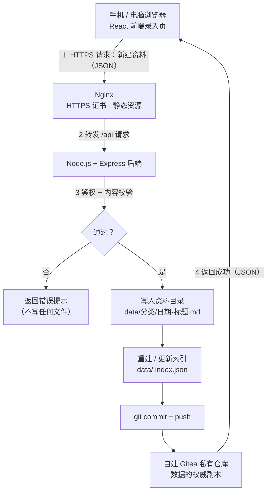
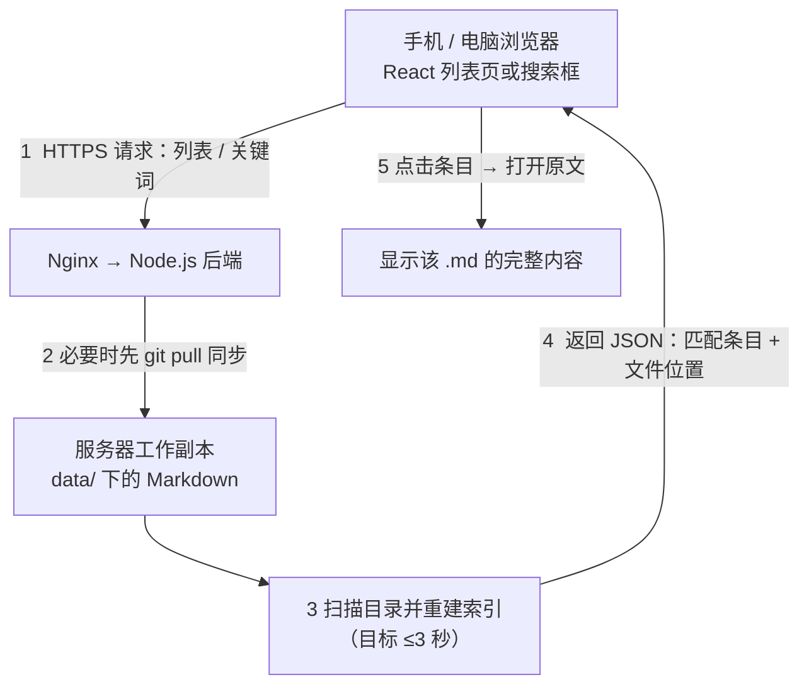
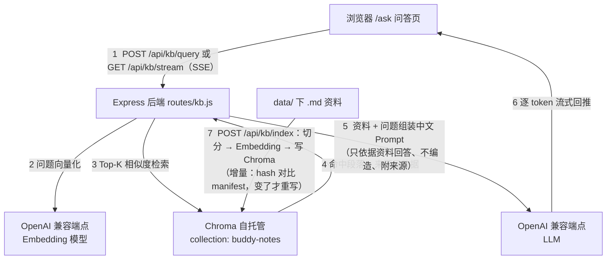
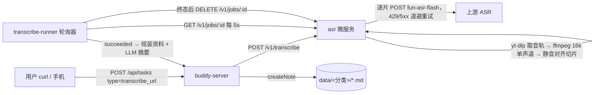
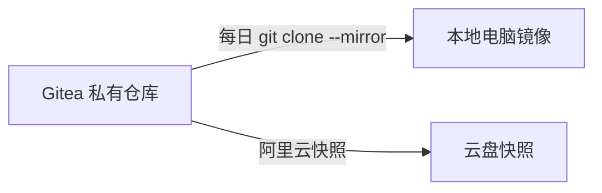
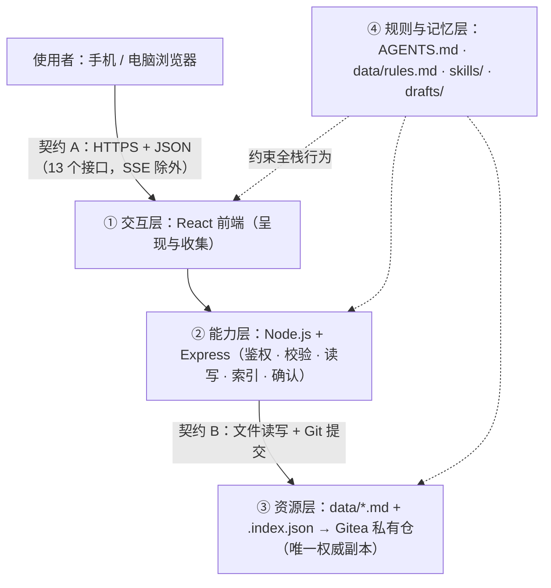

# TECH_DESIGN.md — buddy 技术设计（MVP · 第 1 期）

> 上游依据：`PRD.md` v1.7（F1–F13 与验收标准）。本文只写「为什么这么选」，具体怎么做见 `SPEC.md`。
> 原则：能跑通 > 花哨；数据自有 > 平台便利；每层可替换 > 一次到位。

## 1. 设计目标与约束

**要支撑的功能**：F1 资料录入 / F2 列表与检索 / F3 索引自动更新 / F4 手机端发起任务 / F5 查看进度 / F6 确认操作 / F7 数据自托管与可迁移 / F9 知识库问答。

| 约束 | 来源 |
|---|---|
| 单人使用，不做多用户与协作 | PRD 第 2 章 |
| 手机浏览器直接访问，不装客户端；公网 HTTPS | PRD F4、第 5 章 |
| 个人资料存自建私有仓库，公开仓库看不到 | PRD F1、F7、第 5 章 |
| 部署在已有阿里云 ECS（2 vCPU / 4GB） | 现有资源 |
| 第 1 期不引入业务数据库；索引可再生（Chroma 向量库是派生数据，不是权威副本） | PRD 第 8 章风险 4 |
| 开发环境：Node 20.19+ / 22.12+ | 两台机器实测 |

## 2. 三层分工

| 层 | 职责 | 对应功能 |
|---|---|---|
| 前端 | 做界面、把输入打包成请求、显示结果 | F1 录入页、F2 列表与搜索页、F5 状态页、F6 确认页、F9 问答页 |
| 后端 | 鉴权、校验、读写资料、重建索引（唯一守门人） | F1 写文件、F2 读+检索、F3 重建索引、F4/F5/F6 任务与确认、F9 检索生成 |
| 存储 | 只管存放：资料目录 + 索引文件 + Git 私有仓库 | F7 |

**层间契约**：前端与后端只通过 HTTPS 上的 JSON 请求/响应通信（F9 的流式接口用 SSE）；后端与存储只通过文件读写与 Git 提交。任一层的实现可替换，其他层不用改。

## 3. 技术路线

| # | 层面 | 选型 | 理由 | 备选与不选原因 |
|---|---|---|---|---|
| 1 | 前端 | React + Vite（响应式，一套页面适配手机与电脑） | 组件化省重复代码；Vite 提供热更新与生产构建 | 原生 HTML/CSS/JS：页面一多就靠复制粘贴，状态管理容易乱 |
| 2 | 前端备选 | —— | —— | Vue：能力相当、上手更平缓；本次选 React 是生态与 AI 生成资料更丰富，要换只换交互层 |
| 3 | 后端 | Node.js + Express | 与前端同一种语言；本机已装 Node | Python + FastAPI：可读性好，但与前端语言割裂 |
| 4 | 数据交互 | REST + JSON over HTTPS | 简单直观、弱网够用、调试方便 | GraphQL：接口少，属过度设计 |
| 5 | 存储 | Git 仓库内的 Markdown 文件 + 一个 JSON 索引文件 | 满足 F7（纯文本、可迁移、可回滚），不需要额外服务 | SQLite / 数据库：会引入「文件与库双份数据」的同步问题 |
| 6 | 列表索引 | 打开列表页时扫描资料目录重建，结果缓存为 JSON | 对应 F3「打开时自动重建」，实现最轻 | 全文搜索引擎：数据量小，无必要 |
| 7 | 登录鉴权 | 单用户口令 + 会话 Cookie（HttpOnly）；隐私模块默认关闭 | 单人使用够用且简单 | OAuth / 第三方登录：只有一个人用，接入不划算 |
| 8 | 运行与部署 | Docker 跑后端 + Nginx 反代并签发证书（Let's Encrypt），部署在阿里云 ECS | 单机可跑、环境干净、迁移容易 | 裸装到系统：依赖散落、升级容易出问题 |
| 9 | 手机端形态 | 响应式网页（无客户端） | 满足 F4「不装客户端」；改一次两端生效 | 原生 App / PWA：需要打包与上架流程，与本期目标无关 |
| 10 | 代码与数据分区 | 代码与文档 → GitHub 公开仓；资料数据 → 自建 Gitea 私有仓 | 打卡验收与隐私兼顾 | 全放一处：全公开泄露隐私，全私有则验收不便 |
| 11 | 备份 | 本地 git mirror + 阿里云快照 | 服务器是单点，必须有第二份 | 只靠服务器磁盘：单点故障即丢数据 |
| 12 | AI 编排（F9） | LangChain.js（`@langchain/core` + `@langchain/openai` + `@langchain/textsplitters`），向量库直连 chromadb 官方客户端 | 流式 API 与 splitter 现成；不引 `@langchain/community`（其 peer 依赖与 dotenv@18 冲突） | LangGraph / 手写 fetch：本期只要检索+生成，图编排是杀鸡用牛刀；手写 fetch 要自造切分与流式轮子 |
| 13 | 向量库（F9） | Chroma 自托管（Docker，token 认证或安全组限源） | 数据自有，符合 F7；向量是派生数据，坏了可由 `data/` 重建 | Chroma Cloud 托管：把资料交给第三方，违背数据自有 |
| 14 | 模型端点（F9） | OpenAI 兼容端点统一供 Chat + Embedding（`OPENAI_BASE_URL` 可切；Embedding 可单独配 `EMBED_BASE_URL`） | 一套代码支持 OpenAI / DashScope 兼容模式 / Ollama，改 env 即换模型 | 锁定某家 SDK：DeepSeek 无 embeddings，双端点设计就是为这个坑留的口子 |
| 15 | 转写服务（F13） | 独立 Python + FastAPI 微服务（`asr/`），fun-asr-flash 多模态端点逐片调用；buddy 侧走任务链路异步推进 | 转写是分钟级长任务且依赖 ffmpeg/yt-dlp，与 Node 后端技术栈不同——独立服务才不拖垮主进程；任务链路复用现成的进度可见与重试语义 | 后端内嵌 Python 子进程：状态管理、限流与清理都黏在主进程；filetrans 异步兜底：本期 fun-asr-flash 已够用，仅留扩展位 |

**一句话技术路线**：
> 前端 React（Vite 构建）→ 后端 Node.js + Express（REST/JSON）→ 存储为 Git 仓库里的 Markdown 文件与 JSON 索引 → 部署在阿里云 ECS（Docker + Nginx + HTTPS）。

**为什么「暂时」这么选**：这是在 MVP 与第 2 周目标之间的折中组合，不是最优解，而是「能跑通、且每层都能独立替换」的解。前端选 React 是为第 2 周铺路，代价是首次搭建多一步 `npm install`。

## 4. 数据流图

**权威副本**：自建 Gitea 私有仓库里的 Git 版本是数据的唯一权威副本；服务器上的目录只是工作副本（可随时从仓库重建）。

### 4.1 写入链路（F1 / F3）

```mermaid
flowchart TD
    A["手机 / 电脑浏览器<br/>React 前端录入页"] -->|"1  HTTPS 请求：新建资料（JSON）"| B["Nginx<br/>HTTPS 证书 · 静态资源"]
    B -->|"2  转发 /api 请求"| C["Node.js + Express 后端"]
    C -->|"3  鉴权 + 内容校验"| D{"通过？"}
    D -->|"否"| E["返回错误提示<br/>（不写任何文件）"]
    D -->|"是"| F["写入资料目录<br/>data/分类/日期-标题.md"]
    F --> G["重建 / 更新索引<br/>data/.index.json"]
    G --> H["git commit + push"]
    H --> I["自建 Gitea 私有仓库<br/>数据的权威副本"]
    I -->|"4  返回成功（JSON）"| A
```

### 4.2 读取链路（F2 / F3）

```mermaid
flowchart TD
    A["手机 / 电脑浏览器<br/>React 列表页或搜索框"] -->|"1  HTTPS 请求：列表 / 关键词"| B["Nginx → Node.js 后端"]
    B -->|"2  必要时先 git pull 同步"| C["服务器工作副本<br/>data/ 下的 Markdown"]
    C --> D["3  扫描目录并重建索引<br/>（目标 ≤3 秒）"]
    D -->|"4  返回 JSON：匹配条目 + 文件位置"| A
    A -->|"5  点击条目 → 打开原文"| E["显示该 .md 的完整内容"]
```

### 4.3 数据从哪来、到哪去

| 数据 | 从哪来 | 到哪去 | 谁负责 |
|---|---|---|---|
| 资料内容 | 使用者在手机/电脑上输入 | 服务器 `data/` → 提交进 Gitea 私有仓库 | 前端收集 → 后端写入 |
| 索引 | 扫描资料目录生成 | 服务器 `data/.index.json`（不入公开仓库） | 后端（打开列表页时重建） |
| 任务与确认记录 | 使用者提交的任务与点击的确认 | `data/.runtime/*.json` → 私有仓库 | 后端（未确认不执行） |
| 代码与文档 | 开发机 | GitHub 公开仓（本机只推 camp 组织仓） | Git |

### 4.4 RAG 问答链路（F9）

```mermaid
flowchart TD
    A["浏览器 /ask 问答页"] -->|"1  POST /api/kb/query 或 GET /api/kb/stream（SSE）"| B["Express 后端 routes/kb.js"]
    B -->|"2  问题向量化"| E["OpenAI 兼容端点<br/>Embedding 模型"]
    B -->|"3  Top-K 相似度检索"| C["Chroma 自托管<br/>collection: buddy-notes"]
    C -->|"4  命中段落 + 来源元数据"| B
    B -->|"5  资料 + 问题组装中文 Prompt<br/>（只依据资料回答、不编造、附来源）"| D["OpenAI 兼容端点<br/>LLM"]
    D -->|"6  逐 token 流式回推"| A
    I["data/ 下 .md 资料"] -->|"7  POST /api/kb/index：切分 → Embedding → 写 Chroma<br/>（增量：hash 对比 manifest，变了才重写）"| C
```

### 4.5 转写链路（F13）

```mermaid
flowchart LR
    U[用户 curl / 手机] -->|POST /api/tasks type=transcribe_url| S[buddy-server]
    S -->|POST /v1/transcribe| A[asr 微服务]
    A -->|yt-dlp 取音轨 → ffmpeg 16k 单声道 → 静音对齐切片| A
    A -->|逐片 POST fun-asr-flash，429/5xx 退避重试| M[上游 ASR]
    R[transcribe-runner 轮询器] -->|GET /v1/jobs/:id 每 5s| A
    R -->|succeeded → 组装资料 + LLM 摘要| S
    S -->|createNote| D[(data/<分类>/*.md)]
    R -->|终态后 DELETE /v1/jobs/:id| A
```

- asr 服务把「下载 → 归一化 → 切片 → 逐片转写 → 按实际片长偏移合并」封成一个 job；buddy 只认 job 信封，不碰 ffmpeg/yt-dlp 细节；
- 单片段最终失败时 job `failed` 但 `error.details.partial` 带已完成片段——buddy 仍归档为「部分转写」资料，不全量白跑；
- 同源结果缓存（TTL 1800s）+ 单飞：重复提交同一 URL 不重新下载、不烧二次 ASR 额度。

### 4.6 备份链路

```mermaid
flowchart LR
    G["Gitea 私有仓库"] -->|"每日 git clone --mirror"| L["本地电脑镜像"]
    G -->|"阿里云快照"| S["云盘快照"]
```

## 5. 架构原则与演化策略

> 参考课程《生成式软件工程》（NJU）五条主线。本章目标是让「以后重做某一部分」的成本足够低。

### 5.1 架构全景

```mermaid
flowchart TB
    U["使用者：手机 / 电脑浏览器"] -->|"契约 A：HTTPS + JSON（13 个接口，SSE 除外）"| A["① 交互层：React 前端（呈现与收集）"]
    A --> B["② 能力层：Node.js + Express（鉴权 · 校验 · 读写 · 索引 · 确认）"]
    B -->|"契约 B：文件读写 + Git 提交"| C["③ 资源层：data/*.md + .index.json → Gitea 私有仓（唯一权威副本）"]
    D["④ 规则与记忆层：AGENTS.md · data/rules.md · skills/ · drafts/"] -.->|"约束全栈行为"| A
    D -.-> B
    D -.-> C
```

### 5.2 三条架构原则

| 原则 | 落地 | 好处 |
|---|---|---|
| 关注点分离 | 交互层只呈现、能力层是唯一守门人、资源层只管存放 | 改一处不牵动全身；出错容易定位 |
| 接口契约 | 契约 A：HTTPS + JSON（13 个接口）；契约 B：文件读写 + Git 提交 | 契约稳定，层内实现可自由替换 |
| 信息隐藏 + 单一权威副本 | 存储细节对外隐藏；数据只有一份权威副本（Gitea 私有仓），索引是可重建的派生数据 | 消除「双写不一致」缺陷；服务器损坏可重建 |

### 5.3 可替换点（演化轴）

| 变化轴 | 现在 | 可替换为 | 影响范围 |
|---|---|---|---|
| 前端框架 | React + Vite | Vue / 原生 JS | 仅交互层；契约 A 不变 |
| 部署形态 | ECS + Docker + Nginx | CloudBase（本期不走，第 3 周再评估） | 仅部署方式；代码不变 |
| 存储实现 | Git 内 Markdown + JSON 索引 | SQLite / 云数据库 | 仅能力层与资源层之间；前端不变 |

### 5.4 质量属性 → 设计决策

| 质量属性 | 具体设计 | 依据 |
|---|---|---|
| 可靠性 | 外部操作必须先确认（未确认不执行）；登录由后端统一守门 | PRD F6 验收 3 条 |
| 安全性 | 密钥 / `.env` / 连接串永不入库；公网暴露必须 HTTPS | PRD 全局验收、第 5 章 |
| 可移植性 | 纯文本数据 + Git 版本；一条命令即可整体导出 | PRD F7 验收 3 条 |
| 可维护性 | 文档先行（research → PRD → 技术设计）；术语与目录约定统一 | 本文档与 PRD 的对齐检查 |
| 性能（量化） | 检索 ≤2 秒、索引重建 ≤3 秒、页面加载 ≤5 秒（常用网络、资料 ≤100 条） | PRD 第 4 章判定原则 |
| 可追溯性 | 提交标题 `Day X｜一句话`；只用 `git revert` 回退，保留历史 | AGENTS.md 第 2 节 |

### 5.5 技术债台账

| 债务 | 为什么现在欠 | 何时偿还 |
|---|---|---|
| 列表索引用「扫描目录重建」 | 数据量小，先求跑通 | 资料上千条或检索明显变慢时 |
| 不引入数据库 | 避免双写一致性问题 | 出现并发写或多端冲突时 |
| 无自动化测试、无 CI | 单人项目，验收靠文档清单 | 第 4 周（测试与部署阶段） |
| 资料私有仓尚未搭建（Gitea） | 先跑通链路 | 第 3 周 |
| asr 为单进程 + 磁盘 job 状态 | 单机部署够用，不引队列/Redis | 多副本部署时需要共享 job 存储与队列 |
| 转写归档不自动进向量库 | 避免长任务后静默烧 Embedding 额度 | 使用者确认频次后改为索引钩 |

### 5.6 AI Native 层（规则与记忆）

| 目录 | 作用 |
|---|---|
| `AGENTS.md` | 协作协议 + 产品铁律（规则版本化） |
| `data/rules.md` | 使用者的每条纠正长期生效，新会话先读（本期未实现） |
| `skills/` | 成功流程固化为可读可改的技能（尚未创建） |
| `drafts/` | 未确认产物不落地为正式知识（尚未创建） |

### 5.7 已知弱点

1. **无自动化测试与 CI**：验收依赖人工照单检查（仅有一个冒烟脚本）；
2. **资料私有仓未建**：`sync()` 仍是空操作，Git 备份链路未通；
3. **服务器单点**：靠本地 mirror + 云快照兜底；
4. **规则层靠「约定」执行**：AGENTS.md 无强制机制，只能靠每次会话先读与人工核对。

## 6. 变更记录

| 日期 | 版本 | 改了什么 |
|---|---|---|
| 2026-09-19 | v1.0 | 初版：设计目标与约束、三层分工、技术路线（10 条选型）、数据流图（3 张 Mermaid） |
| 2026-09-19 | v1.1 | 前端由原生 JS 改为 React（Vite 构建）；新增第 5 章架构原则与演化策略 |
| 2026-09-25 | v1.2 | 追加 F9 技术方案：选型 +3、RAG 数据流图、技术债条目修订 |
| 2026-09-28 | v1.3 | 追加 F13 转写链路：选型 +1（独立 FastAPI 微服务）、转写数据流图（4.5，原备份链路顺延为 4.6）、技术债 +2；上游依据升至 PRD v1.7 |
